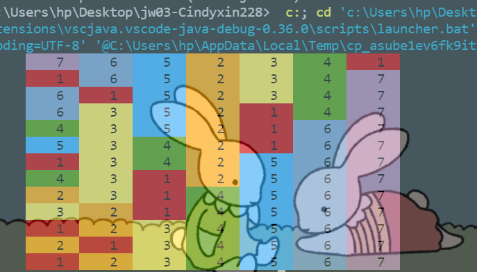

## 任务一

代码理解：

SteganographyFactory用来对图片实行隐写术，即 将图片读入，通过SteganographyEncoder类（对图片进行加密解密的类）的实例调用类中的方法对图片的RGB值进行改写，然后通过ImageIO.write将图片输出，此时输出的文件就是已经被改写隐藏了含有排序字节码的图片。

此时Scene中main函数则可以通过SteganographyClassLoader建立一个自定义的类加载器，它比寻常的类加载器多的功能是为可以从读入的图片中解码出运行所需要的字节码，也即loadclass额外的功能。从而实现利用图片隐藏的字节码实现排序功能的效果。而自定义的类加载器实际上是继承自ClassLoader重写了findClass。

当测试的时候，由于这个排序的类并未被加载过，因此不会在缓存中。同时，我们将用来生成隐写图片的源文件排序文件删除以后，无法正常加载，接着来到了findclass函数，调用自定义的类加载器增加的功能，就用到了解码图片隐写的字节码。以此，Sorter的实例通过解码出的字节码得到的Class来建立。之后的过程就同W02一样了。

## 任务二

图片的URL：

"file:./S191220097.QuickSorter.png"

"file:./S191220097.SelectSorter.png"

## 任务三

动画链接：

#### 快速排序

对应第一张图

<https://asciinema.org/a/ziSItLxDqRSj2yUZMjrXOvjI8>

#### 选择排序

对应第二张图

<https://asciinema.org/a/MqnuHw1wNyOeCnmTo6Er4qp0j>

## 任务四

用的是蒙芷露的图片

结果正确:

